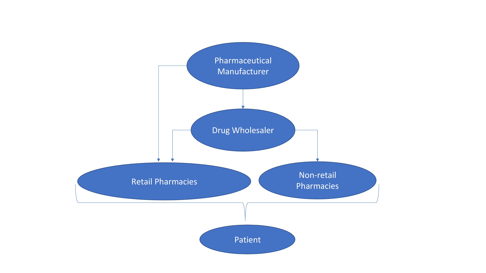

# Capstone
Executive Summary

My motivation for the Drug Distribution Channel project is to determine the flow of drugs to patients from the manufacturer, and then delve into the dynamics of drug distributors’ (i.e., wholesalers and pharmacies) revenue growth vs. consumer spending growth. I want to show that drug distributors’ revenue growth and growth in overall spending on pharmaceuticals will outpace economic growth in the future. I also want to show the drivers of increasing pharmaceutical spend, which mostly emanates from an aging population; a population where chronic diseases are most prevalent.  

I am concerned that continued growth in pharmaceutical spend will weigh heavily on a population that is aging and increasingly dependent on fixed income to survive.

Data Questions

Firstly, I wanted to know is now the best time to invest in the Drug Distribution Channel. A little foreshadowing here but note that Amazon announced its entrance into the home delivery pharmacy market with a drug discount program back in November. 

Secondly, I wanted to know if increasing life expectancy in the US will lead to greater prevalence of chronic disease? 

Lastly, is now the worst of times for elderly patients consuming prescription drugs?

MVP

I plan to utilize excel and Tableau to present my project. The flow of the presentation is as follows:

1.  Define the flow of drugs from manufacturer to patient.
2.  Drill down to growth dynamics of drug wholesalers and pharmacies, and the US consumer.
3.  Show research that points to an aging population in the US
4.  Show research that suggests aging population will lead to greater chronic conditions
5.  Show increasing utilization of drugs by older people; 65 compared to other age demographics

6. Cost of pharmaceuticals as a barrier to care 

Audience 

Insurers, most notably government entities like Medicare and State Medicaid institutions. The audience could also be entities looking to enter the drug distributor network given all of the tailwinds coming from increasing drug spend. Take for example, Amazon, which announced on 11.17.2020 it would offer prescription discounts and prescription home delivery.

Challenges

Given how broad and messy government data can be, I have encountered issues with cleaning the data extensively. Also, since I am pulling from multiple sources into Tableau- there have been plenty of technical difficulties. 

